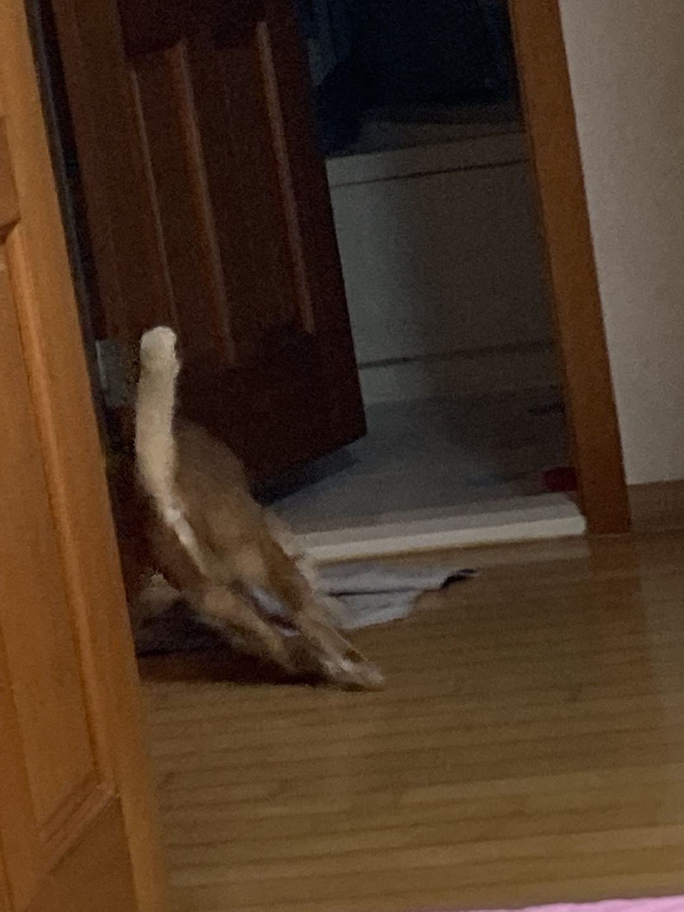
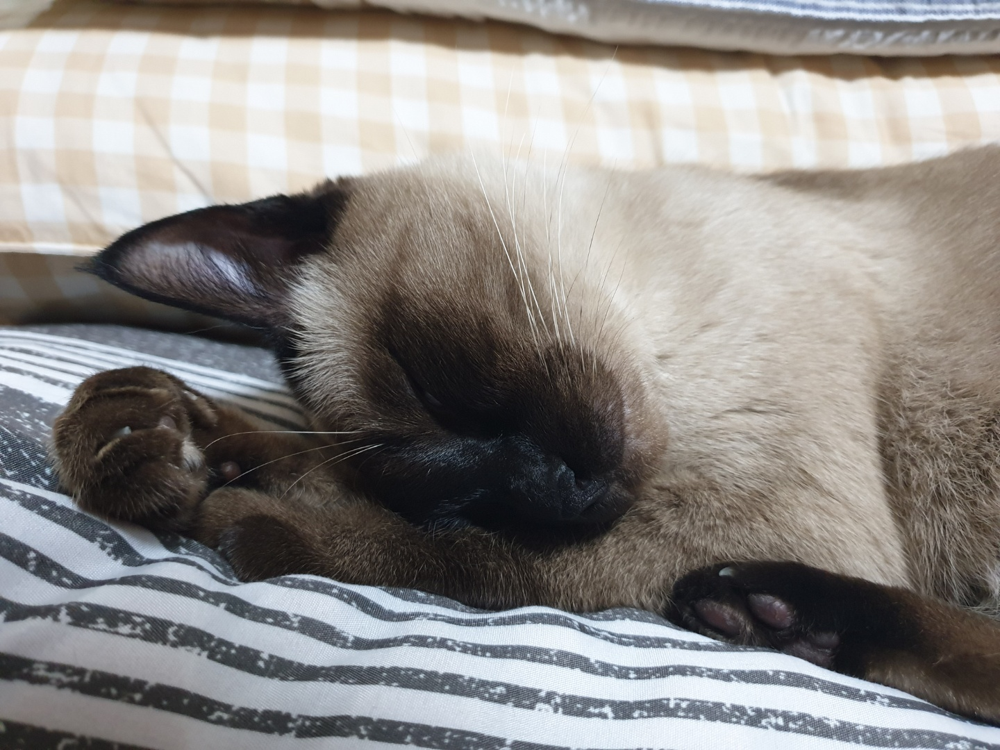
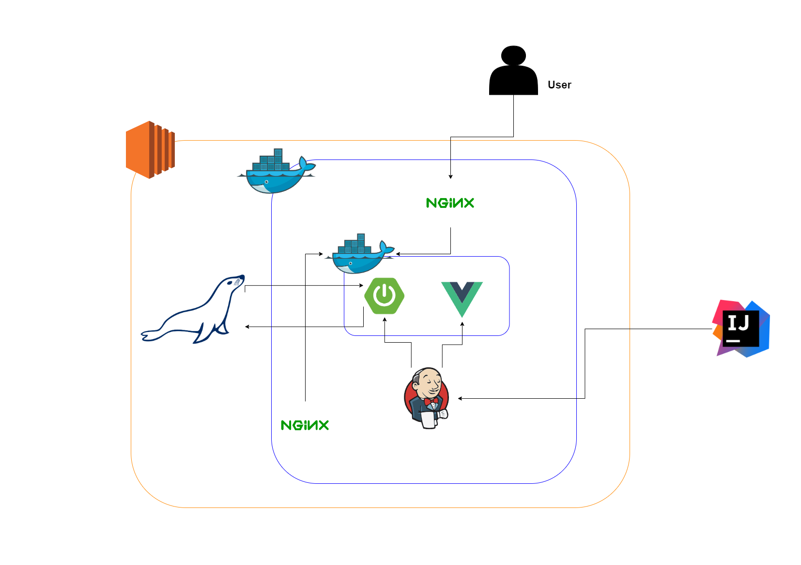

# S09P11A204

팀장이 P래~~

# V1.0.0

<전체를 뒤엎을 변화>,<기능 수정, 기능 추가>,<버그, 내부 적 코드 보완>

# IV1.0.0

## 서비스 소개

> (프로젝트이름)

- 물류 자동화 시스템

 

## 팀원 소개 및 담당 역할

- 한장민 (팀장) : Frontend 메인, Backend 보조, 발표
- 이종민 (팀원) : Backend 메인, Frontend 보조
- 권도현 (팀원) : Backend 메인, Frontend 보조
- 이승혁 (팀원) : IoT 개발
- 채문희 (팀원) : IoT 개발
- 서강운 (팀원) : IoT 개발

| 한장민 [@HAANJM](https://github.com/HAANJM)                     | 이종민 [@john0513](https://github.com/john0513) | 권도현 [@yup8229](https://github.com/yup8229)          |
| --------------------------------------------------------------- | ----------------------------------------------- | ------------------------------------------------------ |
|  |    |  |

| 이승혁 [@skymoon0228](https://github.com/skymoon0228)                                                  | 채문희 [@enduser0](https://github.com/enduser0)     | 서강운 [@sku379829](https://github.com/sku379829) |
| ------------------------------------------------------------------------------------------------------ | --------------------------------------------------- | ------------------------------------------------- |
|  |  |     |

 

## 기술 스택

- IoT :
- Frontend : Vue.js, Vuex, axios, router
- Backend : Java, Spring, MySQL, mariaDB
- Infra : Jenkins, AWS EC2, NginX, Docker

 

## DETAIL

### 0. Conventions

- **git commit message**

  > type: Subject 형태로 작성하기

  type

  - [feat]: A new feature
  - [fix]: A bug fix
  - [docs]: Changes to documentation
  - [style]: Formatting, missing semi colons, etc; no code change
  - [refactor]: Refactoring production code
  - [test]: Adding tests, refactoring test; no production code change
  - [chore]: Updating build tasks, package manager configs, etc; no production code change

  Subject

  - 50자를 넘기지 말 것
  - 대문자로 시작하며 마침표는 적지 않을 것
  - 명령조로 말할것. 예를들면 changed, changes 가 아닌 change
  - 메인 커밋 메세지에 []를 통해서 표시해주기

- **GitLab branch 전략**

  - master : 제품으로 출시될 수 있는 브렌치. 최선의 상태 유지
  - study : 프로젝트 기간동안 공부한 내용을 각자 정리하는 브렌치
  - dev : 개발과정에서 fe/be/iot의 코드를 모아 빌드하여 테스트 하는 브렌치
  - feature/(fe, be, iot)/기능명 : 해당 기능 구현을 진행할 때 사용하는 브렌치
  - hotfix : master의 문제를 해결하기 위한 브렌치

- **Jira**

  - 이슈생성
  - 월요일에 주 단위 스프린트 이슈들을 생성
  - 일주일에 40시간 이상 이슈 생성 및 처리
  - 이슈 완료
  - 하나의 티켓은 되도록 하나의 커밋으로 처리

- **Style Guide**

  FE

  - var대신 const, let 사용하기
  - 가능한 Arrow Function 사용하지 않기
  - 변수명 : file_scope 상수는 UPPER_SNAKE_CASE, 그 외엔 camelCase. Boolean변수는 앞에 is 붙이기.
  - 클래스(생성자)명 : 파스칼 케이스를 이용한다. PascalCase
  - 클래스(HTML)명 : 케밥 케이스를 이용한다. kebal-case

  BE

  - 변수명, 인스턴스명: camelCase
  - 상수 변수명(static final): 대문자, 띄어쓰기는 \_ 사용
  - 클래스명, 생성자명: PascalCase
  - 함수명: camelCase(동사 + 명사로 구성)
  - Mysql table, column name: snake_case

  IoT

  - 예시1
  - 예시2

### 1. Planning & Design

- 아이디어 정리
- 와이어 프레임
- ERDCloud
- API 명세서
- 아키텍처
  

 

### 2. Development & Test

### 3. Operation

### 4. ETC
