# S09P11A204

팀장만P래~

# V1.3.2

<전체를 뒤엎을 변화>,<기능 수정, 기능 추가>,<버그, 내부 적 코드 보완>

# IV1.0.0

## 기간
> 2023/07/04 ~ 2023/08/18

## 서비스 소개

> Turtle Logistics

- 물류 자동화 시스템

## 발표자료
추후 업데이트 예정

## 기능구현
- IoT
  - 수신한 주문 데이터에 따른 상품을 컨베이어 벨트로 이동
  - 상품 갯수에 따른 피스톤 동작 횟수 입력으로 상품 이동
  - 카메라 모듈을 통해 QR을 인식하여 주문 데이터와 맞는 상품인지 확인
  - 주문 데이터의 주소에 따른 가름막 작동으로 분류
  - 분류가 주소에 알맞게 되었는지 가름막의 센서로 확인 후 정보 전송
- Web
  - 관리자 / 사용자 회원가입, 로그인, 로그아웃
  - 기간별(1주, 1개월, 3개월, 6개월, 1년) 주문 건수 그래프
  - 지역별(광역시, 도) 주문 상황 조회 지도
  - 현재 주문 접수, 분류, 배송 상황에 따른 집계 그래프
  - 분류 시스템의 오류 현황 로그 조회
  - 오류 발생 지점을 파악하는 단면도 조회
  - 공정 전체 과정을 관찰하는 CCTV 시스템
  - 공정 작동
- DB
  - DB 최적화 인덱싱 작업을 통해 약 500만개의 데이터에서 빠르게 물류 데이터를 조회
  - 집계 그래프를 위한 주문 접수, 분류, 배송 상황 정보
 

## 팀원 소개 및 담당 역할

- 한장민 (팀장) : Frontend 메인, Backend 보조, 발표
- 이종민 (팀원) : Backend 메인, Frontend 보조
- 권도현 (팀원) : Backend 메인, Frontend 보조
- 이승혁 (팀원) : IoT 개발
- 채문희 (팀원) : 기구 개발
- 서강운 (팀원) : IoT 개발

| 한장민 [@HAANJM](https://github.com/HAANJM)                     | 이종민 [@john0513](https://github.com/john0513) | 권도현 [@yup8229](https://github.com/yup8229)          |
| --------------------------------------------------------------- | ----------------------------------------------- | ------------------------------------------------------ |
|  |    |  |

| 이승혁 [@skymoon0228](https://github.com/skymoon0228)                                                  | 채문희 [@enduser0](https://github.com/enduser0)     | 서강운 [@sku379829](https://github.com/sku379829) |
| ------------------------------------------------------------------------------------------------------ | --------------------------------------------------- | ------------------------------------------------- |
|  |  |     |

 

## 기술 스택

- IoT : PyQT, AWS IoT Core, MQTT, OpenCV, C++, Python
- Frontend : Vue.js, JS
- Backend : Java, Spring Boot, Spring Security, MySQL, JPA
- Infra : Jenkins, AWS EC2, NginX, Docker, Certbot

 

## DETAIL

### 0. Conventions

- **git commit message**

  > type: Subject 형태로 작성하기

  type

  - [feat]: A new feature
  - [fix]: A bug fix
  - [docs]: Changes to documentation
  - [style]: Formatting, missing semi colons, etc; no code change
  - [refactor]: Refactoring production code
  - [test]: Adding tests, refactoring test; no production code change
  - [chore]: Updating build tasks, package manager configs, etc; no production code change

  Subject

  - 50자를 넘기지 말 것
  - 대문자로 시작하며 마침표는 적지 않을 것
  - 명령조로 말할것. 예를들면 changed, changes 가 아닌 change
  - 메인 커밋 메세지에 []를 통해서 표시해주기

- **GitLab branch 전략**

  - master : 제품으로 출시될 수 있는 브렌치. 최선의 상태 유지
  - study : 프로젝트 기간동안 공부한 내용을 각자 정리하는 브렌치
  - dev : 개발과정에서 fe/be/iot의 코드를 모아 빌드하여 테스트 하는 브렌치
  - feature/(fe, be, iot)/기능명 : 해당 기능 구현을 진행할 때 사용하는 브렌치
  - hotfix : master의 문제를 해결하기 위한 브렌치

- **Jira**

  - 이슈생성
  - 월요일에 주 단위 스프린트 이슈들을 생성
  - 일주일에 40시간 이상 이슈 생성 및 처리
  - 이슈 완료
  - 하나의 티켓은 되도록 하나의 커밋으로 처리

- **Style Guide**

  FE

  - var대신 const, let 사용하기
  - 가능한 Arrow Function 사용하지 않기
  - 변수명 : file_scope 상수는 UPPER_SNAKE_CASE, 그 외엔 camelCase. Boolean변수는 앞에 is 붙이기.
  - 클래스(생성자)명 : 파스칼 케이스를 이용한다. PascalCase
  - 클래스(HTML)명 : 케밥 케이스를 이용한다. kebal-case

  BE

  - 변수명, 인스턴스명: camelCase
  - 상수 변수명(static final): 대문자, 띄어쓰기는 \_ 사용
  - 클래스명, 생성자명: PascalCase
  - 함수명: camelCase(동사 + 명사로 구성)
  - Mysql table, column name: snake_case

  IoT

  - 예시1
  - 예시2

### 1. Planning & Design

- 아이디어 정리
- 와이어 프레임
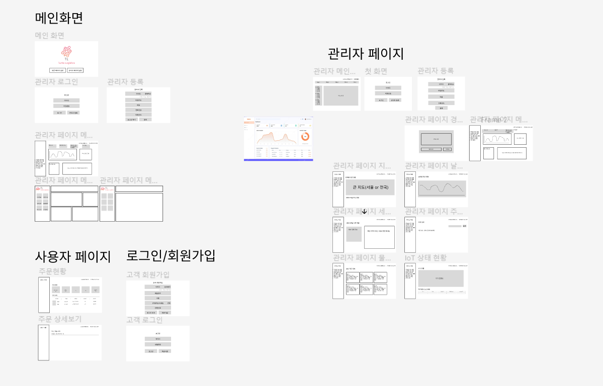
- ERDCloud
수정중
- API 명세서
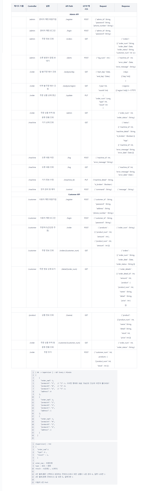
- 아키텍처
  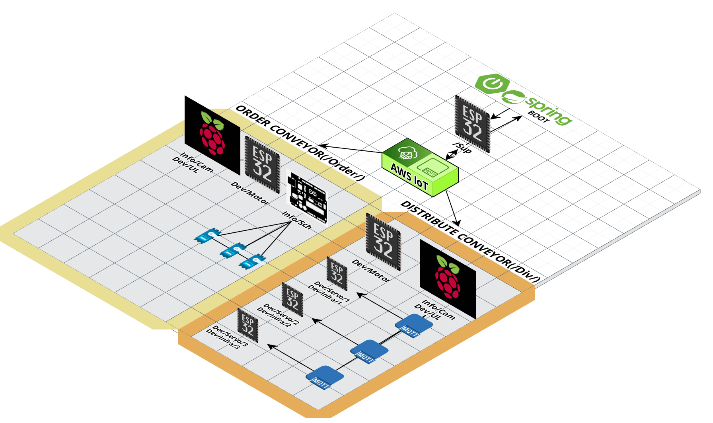
  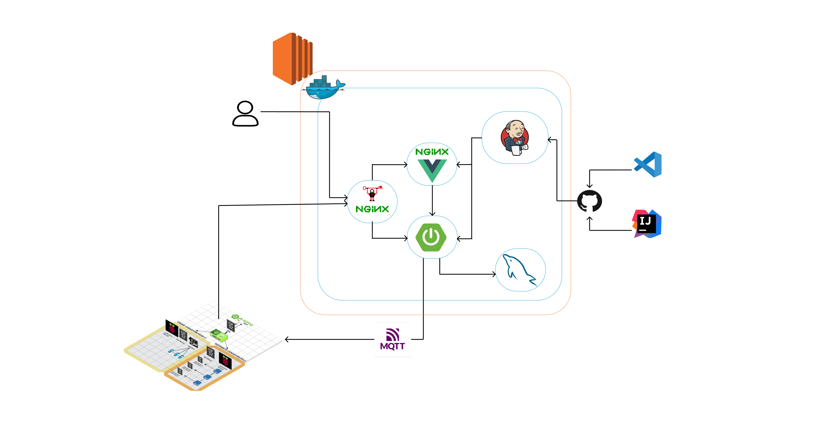

 

### 2. Development & Test

- H/W Development

  - 피스톤  
    ### vh.1
    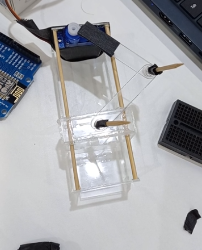 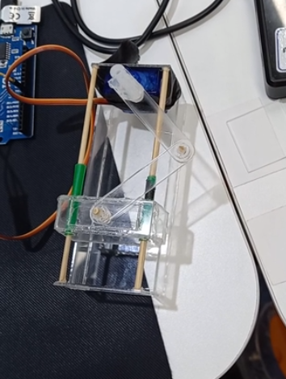
    ### vh.2
    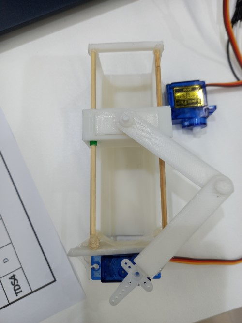
    ### vh.3
    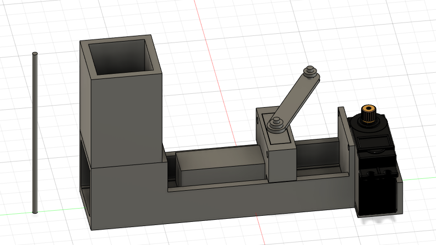 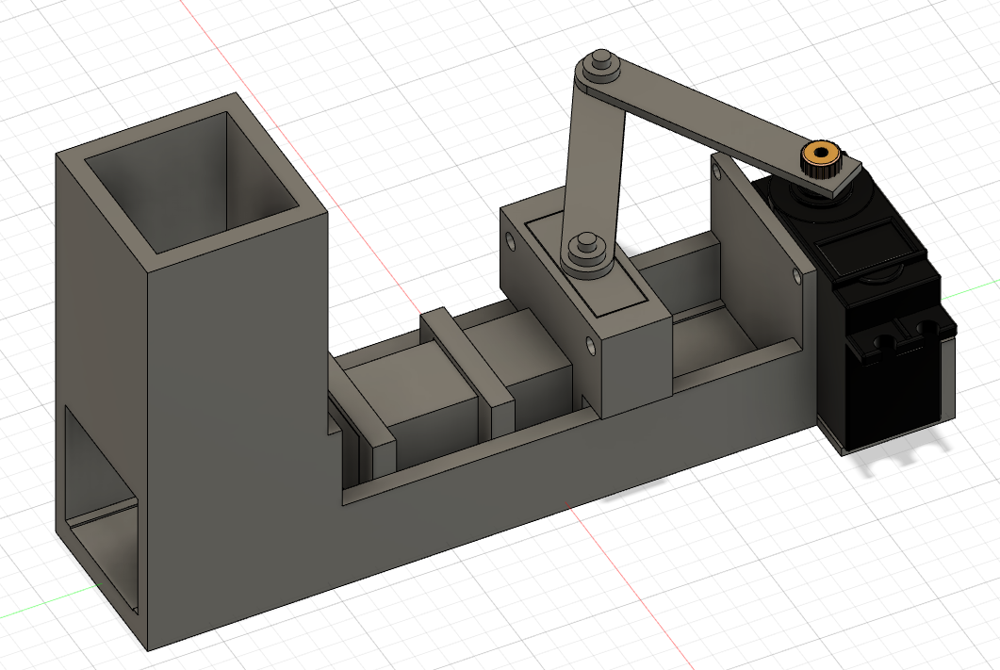
  - 컨베이어 벨트  
    ### iv.1
    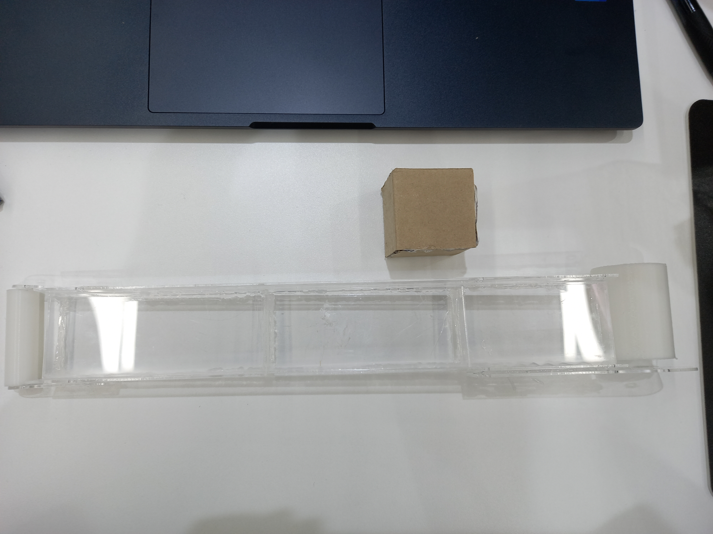 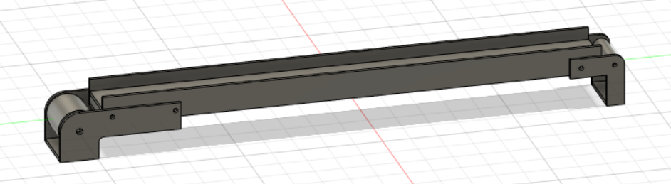
    ### iv.2
    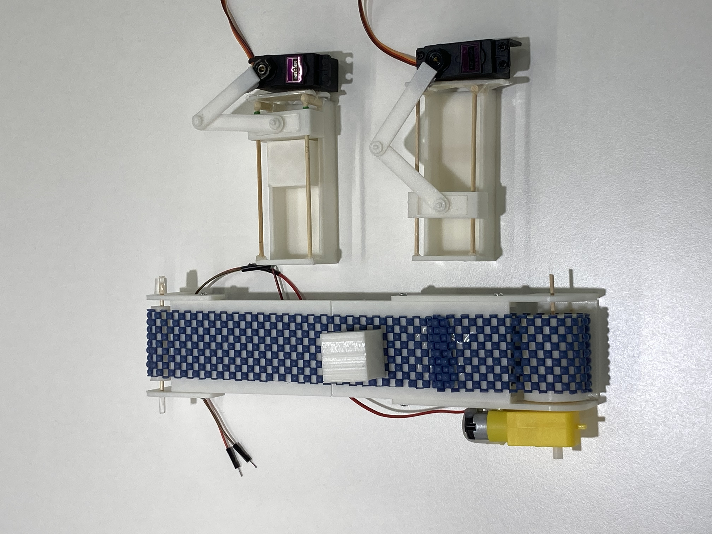  
    ### iv.3
    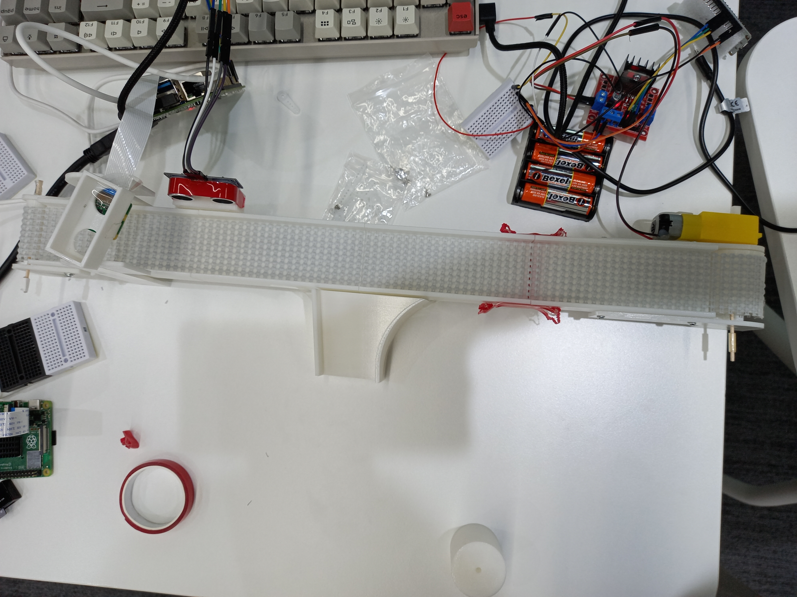
  - 전체 공정  
  추후 업데이트 예정~

- Jira를 통한 일정관리
  - 매 주 월요일에 주 단위 이슈를 생성하고 금요일까지 40의 Story Point를 완료하기 위해 노력함

  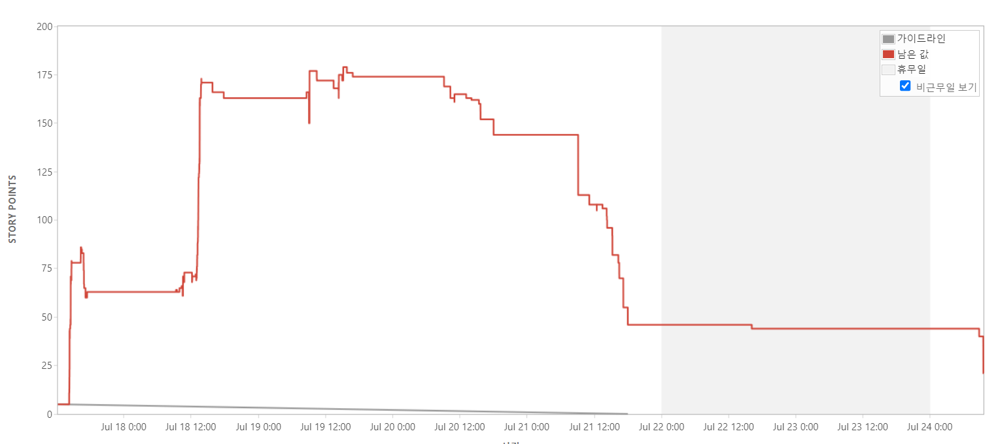
  3주차 번다운 차트

  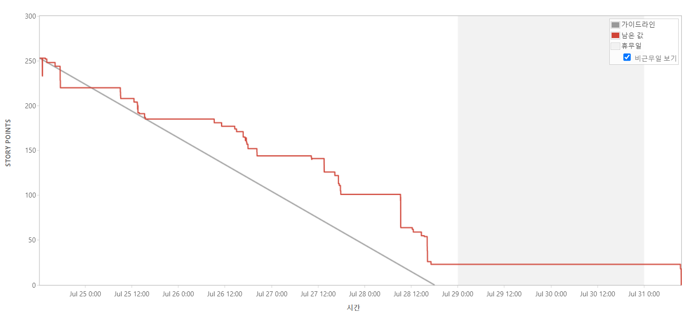
  4주차 번다운 차트

  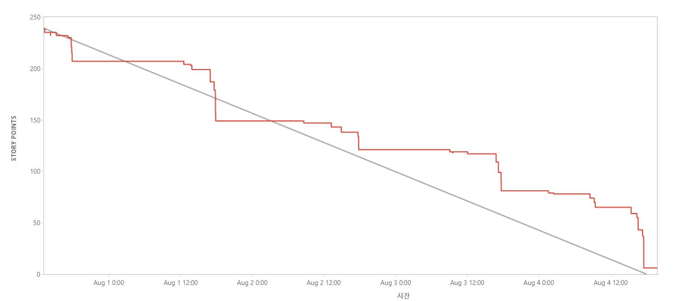
  5주차 번다운 차트

- Confluence를 통한 문서 작업 및 기록

### 3. Operation

### 4. ETC
